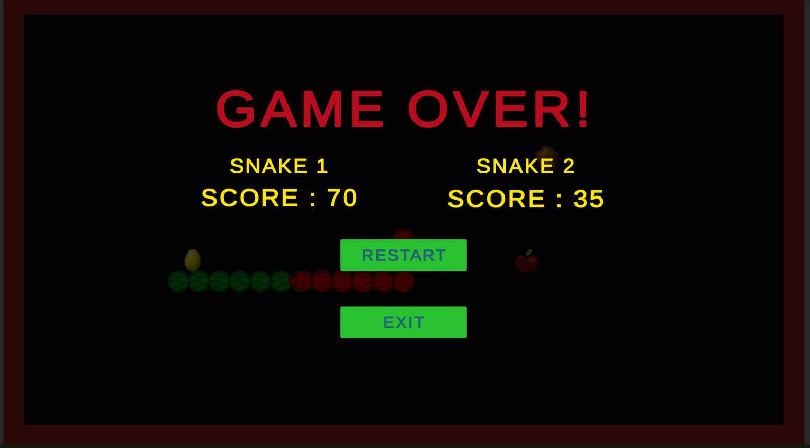

# Snake Game 2D
A retro based 2d snake game but with a twist of having two different snake with two different inputs for movement.

# Instructions for the game
- Snake One will move using WASD Keys.
- Snake Two will move using Arrow Keys.

# Features of the game
- Implemented Screen Wrapping for Snakes.
- Implemented Co-op feature with dual snakes.
- Included features like random food spawning and powerups spawing.
- Increasing score per food eaten, types of collectable foods, different powerups. 

